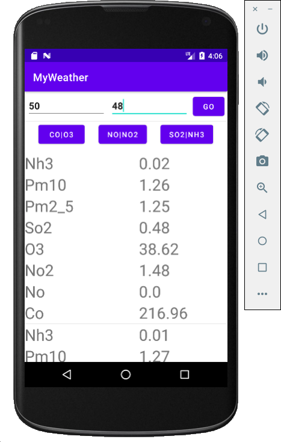
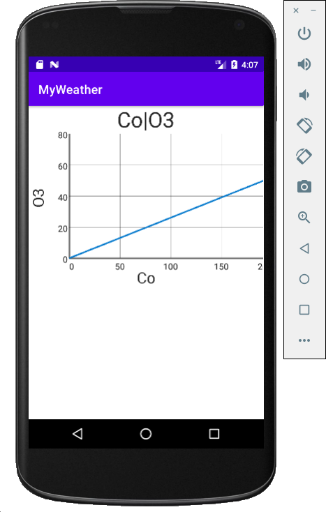

# AirPollution

This project provides an air quality of a geolocation Lat and Long.

This Android app uses combination of:
- MVVM
- androidx.lifecycle
- Retrofit
- Data Binding
- Parcelable on Models etc..
-----------------

